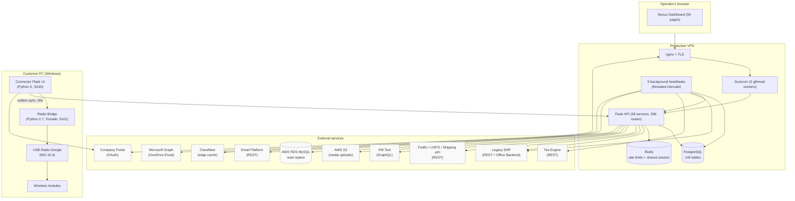

# Nexus -- System Architecture

> A map of what Nexus is, what it connects to, and how the pieces communicate.

## The one-sentence summary

Nexus is a Python 3 / Flask / PostgreSQL operations platform that connects a mid-size B2B/B2C manufacturer's legacy ERP, tax engine, shipping carriers (FedEx, USPS, multi-carrier shipping service), email platform, project management tool, and a custom Windows desktop connector that manages wireless modules -- 58 services, 145 database tables, 596 API routes, 9 background heartbeats, and a 56-page operations dashboard built entirely in vanilla JavaScript.

## The context diagram

## Three-zone data model

The database is deliberately partitioned into three zones, each with different write semantics:

- **ERP Zone** (~35 tables) -- the products, SKUs, options, inventory, orders, and sync-audit tables. Write path is exclusively the 9 heartbeat services. Routes don't write to this zone; they read. Every change is logged to `sync_changelog` with the triggering service and the field-level diff.
- **Relations Zone** (16 tables, `rel_*` prefix) -- Portal-editable entity taxonomy, option groups, bundled credits, and link-group logic. This is the only zone where user-triggered writes are expected. It sits on top of the ERP zone and is the layer operators edit through the dashboard.
- **Portal Zone** (1 table, `portal_sku_metadata`) -- SKU-level display overrides synced from an external company portal RDS instance. Intentionally minimal; most portal data flows through the REST API rather than being mirrored locally.

Every read path in the application knows which zone it's reading from and applies the appropriate access controls -- public reads (catalog, feeds) only touch the ERP zone, authenticated user writes only touch the Relations zone, and system-triggered writes only happen inside heartbeat services.

## How data flows

### The inbound path (ERP to Nexus)

1. **The ERP REST API** is polled every 5 minutes by `product_stamp_heartbeat` (products/SKUs/options), `inventory_heartbeat` (stock levels), and `order_heartbeat` (new orders). Each uses a stamp-based delta query -- only records modified since the last successful checkpoint.
2. **The ERP Office Backend** (the internal PHP admin pages) is scraped via authenticated HTTP sessions for data the REST API doesn't expose -- deal configurations, purchase orders, warehouse names. This is done with BeautifulSoup because the REST API is missing required fields (discount amounts, coupon codes, PO line items).
3. **The tax engine** is polled every 5 minutes by `tax_engine_heartbeat` for new tax transactions. Reads are free and unlimited; the reconciliation pipeline uses them as an authoritative tax ledger without ever writing back.
4. **Microsoft Graph** polls a SharePoint-hosted Excel workbook every 15 minutes, using ETag-aware change detection to skip downloads when the file is unchanged. Parsed data flows into the ERP zone via `erp_excel_sync`.
5. **Nightly full-refresh** at 1:30 AM UTC runs a 7-step pipeline that full-scans every record regardless of stamp -- the safety net that catches silent ERP edits that don't bump their modification timestamps.

### The outbound path (Nexus to external)

1. **Pricing writes** flow from `pricing_service.py` to the ERP's office backend via authenticated scraping, then immediately re-read the page to verify the write persisted. The three-state queue (queued, applied, verified) prevents drift between what was requested and what was accepted.
2. **Shipping label generation** calls FedEx and USPS REST APIs directly, with hazmat detection routing packages through carrier-specific dangerous goods workflows.
3. **Email campaigns** push to the email platform via the REST API, with status synced back from the PM tool via the `email_sync_heartbeat`.
4. **Cloudflare cache purge** is called after every edit to a cached resource (events, catalog, connector updates).

### The connector path (customer PC to Nexus)

The Windows connector doesn't use the main Portal OAuth because customers aren't employees. Instead, each connector instance has its own SHA256-hashed API key. Test sessions are written to a local SQLite database first, then a background thread pushes unsynced records to the testing ingest endpoint every 30 seconds. UUIDs generated at session creation are the deduplication key, so retries are safe. Permanent failures (HTTP 400/422) stop retrying so malformed data doesn't loop forever.

## The resilience layer

Every background heartbeat wraps its work in the same pattern:

1. **Stagger on startup** -- first tick sleeps a random 30-120 seconds to avoid thundering-herd across restarts.
2. **Hydrate from health log** -- on boot, restore last run time, count, and duration so stats survive process restarts.
3. **Try work, catch everything** -- any unhandled exception increments `_consecutive_errors`.
4. **Circuit break at 10** -- after 10 consecutive failures, disable the service via a file-backed flag. All workers see it atomically, and it survives process restarts.
5. **Log to both health log and sync changelog** -- operations log plus field-level change log, correlatable by timestamp.
6. **Sleep with jitter** -- `time.sleep(interval + random.uniform(0, jitter))` before the next tick.

On server startup, a recovery service scans the health log for services that failed within the last two hours and triggers a `force_run()` in dependency order (product stamps, then inventory, then vendor sync) before the regular scheduled ticks resume. The net result is that a server restart doesn't create a visible data gap -- the system self-heals from where it left off.

## The five featured components

These are the load-bearing operational systems that carry the most business impact. Each has its own component doc and some have case studies.

- **Pricing Automation** -- manual pricing cycle collapsed to hours, per-product operation locks, three-state verify-on-write queue, SSE progress streaming with POST fallback. See [case study](../case-studies/pricing-automation.md) for scale numbers.
- **Tax Reconciliation** -- tens of thousands of transactions reconciled across the tax engine, the ERP, and Stripe CSV imports via a four-tier smart column resolver (exact, alias, fuzzy, content sniffing), 50-state post-Wayfair nexus exposure tracking.
- **QC Tracking** -- full lifecycle from serial registration through triage queue, session auto-abandon after 24 hours, incremental inventory ledger via `ON CONFLICT DO UPDATE`. See [case study](../case-studies/qc-tracking.md) for scale numbers.
- **Deal Drift Detection** -- nightly scrape of deal configurations via authenticated HTML parsing (REST API omits the critical fields), field-by-field diff with severity tiering, 30-day snapshot retention, circuit-broken at 10 failures.
- **Shipment Tracking** -- multi-carrier tiered polling (urgent/active/dormant) across FedEx and USPS with pattern detection for UPS and Amazon, deterministic carrier detection from tracking number format, ETA preservation via SQL COALESCE, April 2026 carrier API access control workaround via a multi-carrier shipping service.

## The connector subsystem (separate story)

The Nexus Connector is architecturally distinct from the main API. It's a Windows desktop application that manages wireless modules in the field -- not a cloud service. Its design is covered in depth in the [connector/](../connector/) folder: two-process isolation (Python 3 UI + Python 2.7 bridge over localhost HTTP), RF scaling strategy, bridge watchdog + dual-layer auto-recovery, BLE integration for wireless modules, and the offline-resilient outbox sync back to the main API.

## What's not on this diagram

- Historical systems from before the PostgreSQL migration (they were SQLite)
- Internal ticket tracking (lives in the PM tool, not Nexus)

All components on the diagram are live and carrying production traffic.
