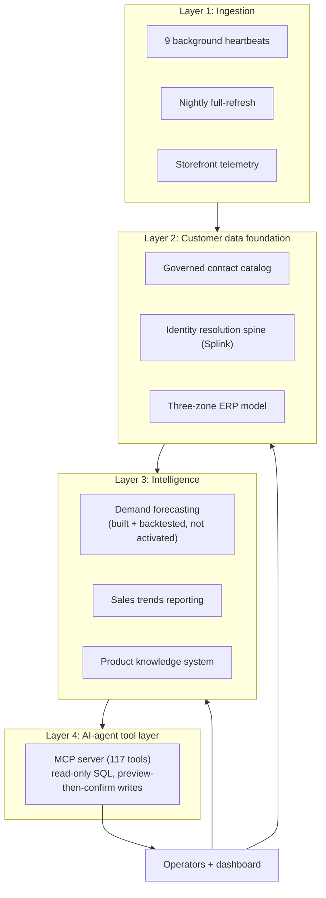

# Nexus System Architecture

> A map of what Nexus is, what it connects to, and how the pieces communicate. The platform began in late December 2025 and has run in production since February 2026. Every component named here exists in the code as of a July 2026 review. This document describes the live architecture, not a planned one.

## The one-paragraph summary

Nexus is a Python 3 / Flask / PostgreSQL operations platform for a multi-brand B2B/B2C hardware manufacturer. It connects the company's hosted ERP, tax platform (Avalara), shipping carriers (FedEx, USPS, Shippo), email marketing (Moosend), project management (Monday.com), a first-party storefront event stream, and a custom Windows desktop connector that manages wireless hardware modules. It runs on one small production VPS behind a CDN, with a companion dedicated worker VPS for heavier background jobs. A July 2026 re-measure puts the codebase at roughly 160 service modules, roughly 850 routes, and roughly 150K lines of Python; the canonical, method-cited counts live in [METRICS.md](../METRICS.md).

## The four-layer platform

Nexus is organized as four layers, and this is the spine of the whole system. Data moves upward. Raw records enter through ingestion, settle into a governed customer data foundation, feed an intelligence layer, and are exposed to operators and to an AI-agent tool layer. Each layer has a different write discipline, so a fault in one layer does not silently corrupt the layer above it.

### Layer 1: Ingestion

Ingestion is the boundary between external systems of record and Nexus. Nine background heartbeat services poll the ERP (products, SKUs, options, inventory, orders), Avalara (tax transactions), Monday.com (restock dates and campaign status), Moosend (campaign delivery), and a SharePoint-hosted Excel workbook (via Microsoft Graph). A nightly full-refresh pipeline full-scans every record regardless of change stamp, which is the safety net for silent ERP edits that do not bump a modification timestamp. Two things that the ERP REST API does not expose, deal configurations and purchase-order line items, are read from the ERP's office backend through authenticated HTML parsing. A first-party storefront event stream is the newest ingestion source: a small event taxonomy captures on-site behavior directly rather than depending on a third-party analytics vendor, so the data stays owned and joinable to the rest of the platform. Ingestion never lets a downstream failure block an upstream poll: each heartbeat carries its own circuit breaker and checkpoint. See [heartbeat services](../components/heartbeat-services.md), [ADR-005](../decisions/005-circuit-breakers-on-external-apis.md), [ADR-006](../decisions/006-checkpoint-based-incremental-sync.md), and [ADR-003](../decisions/003-nightly-full-refresh-alongside-delta-sync.md).

### Layer 2: Customer data foundation

The foundation is where ingested records become a governed, deduplicated, identity-resolved base that everything above it can trust.

The database is partitioned into three write-discipline zones (detailed below): an ERP zone written only by heartbeats, a Relations zone for user-triggered edits, and a small Portal zone synced from an external portal instance.

On top of the ERP zone sits a **customer contact catalog**: a governed PostgreSQL mirror of the company's customers and contacts, 43,000+ customers and 117,000+ contacts as of July 2026. A nightly self-healing enumeration re-walks the source so the mirror repairs its own drift rather than depending on a one-time import. Duplicate detection runs as deterministic pure-SQL grouping, which produced 16,705 duplicate groups; deterministic grouping was chosen for this stage because exact and near-exact duplicates should resolve the same way every run, with no model variance to explain to a stakeholder. Corrections do not write blindly: a staged verified-write remediation applied roughly 31,650 corrections, each staged and checked before commit, and that pass completed in June 2026.

Above deterministic grouping sits an **identity resolution engine** for the harder problem of collapsing many contacts into one real person. It uses Splink for probabilistic record linkage. Deterministic rules alone miss fuzzy matches (a shortened name, a changed address, a typo), and probabilistic linkage scores those pairs instead of dropping them. The certified build resolved ~27,900 persons with a measured false-merge rate of 0.48% and 86.8% held-out recall, deployed June 22, 2026; the current spine holds ~29,500 persons. Cannot-link invariants keep known-distinct people from ever merging even when their attributes look similar, a belt-and-suspenders guard against the one class of error that is expensive to undo. A nightly rebuild worker keeps the spine current, and its automatic runs are gated behind exclusion-flag completion: the rebuild only runs unattended once the exclusion review for that cycle is finished, which is an honest operational gate rather than a claim that the rebuild is safe to run at any time.

### Layer 3: Intelligence

The intelligence layer reads the foundation and produces forecasts and reporting. It writes nothing back into the operational zones.

**Demand forecasting** classifies each item by demand pattern using ADI and CV2, then routes to the model that fits that pattern: AutoETS for series with enough regular signal, Croston SBA for intermittent demand, and a recent-mean fallback for the sparsest items. Accuracy is measured with WAPE and MASE on rolling-holdout backtests rather than on in-sample fit, and a 757K-row inventory ledger is used to correct for censoring so stockout periods are not read as low demand. Against the manual planning curve, the model's seasonal shape correlates at 0.97. This system is built and backtested, and it is not activated in production. It is documented here as engineering that exists and has been validated offline, not as a live input to purchasing.

**Sales trends reporting** is in production as of July 6, 2026. It is a category-to-SKU drill-down matrix with signed year-over-year deltas, date-range and granularity controls, and CSV export, verified against roughly 72K rows of history. Its companion profitability view intentionally excludes SKUs that have uncosted components rather than showing a margin the data cannot support; a missing number is safer for a purchasing decision than a confidently wrong one.

**The product knowledge system** turns a catalog of multi-option products into structured, queryable knowledge. It decomposes each product's option graph down to the component SKUs that a given configuration actually consumes, harvests specifications with provenance tracking so every value carries where it came from (61 specification definitions and 145 values), and derives compatibility from interface data rather than hand-maintained lists (coverage ranges from 57% to 99.6% across product families, with 19 bad edges caught by adversarial verification before they shipped). A single content-review console, live since June 26, 2026, is where a reviewer approves harvested content, and a one-fetch public product-page aggregate endpoint returns the assembled view in roughly 300ms. See the [product catalog component](../components/product-catalog.md).

### Layer 4: AI-agent tool layer

The top layer exposes Nexus to AI agents through a Model Context Protocol server: 117 tools as verified in July 2026. Reads go through a dual-layer read-only SQL guard so a generated query cannot mutate data. Writes are never silent: every write is preview-then-confirm, so the agent proposes a change, the change is shown, and it applies only on explicit confirmation. Before any of this reaches production it passes a three-phase pre-deployment security gate, the same gate that catches injection and access findings in the validation pass rather than in the field. See [ADR-021](../decisions/021-pre-deployment-security-audit-pattern.md).

## The context diagram (live traffic)

The four-layer view above is the spine. The diagram below is the live integration and traffic map underneath it.

```mermaid
flowchart TB
    subgraph Browser["Operator's browser"]
        Dashboard["Nexus Dashboard"]
    end

    subgraph VPS["Production VPS"]
        direction TB
        Nginx["nginx + TLS"]
        Gunicorn["Gunicorn (gthread workers)"]
        Flask["Flask API"]
        Postgres[("PostgreSQL")]
        Redis[("Redis<br/>rate limits + shared session")]
        Heartbeats["9 background heartbeats<br/>(threaded intervals)"]

        Nginx --> Gunicorn
        Gunicorn --> Flask
        Flask --> Postgres
        Flask --> Redis
        Heartbeats --> Postgres
        Heartbeats --> Flask
    end

    subgraph Worker["Worker VPS"]
        IdentityJob["Identity resolution rebuild"]
        ForecastJob["Forecast backtests"]
    end

    subgraph Agents["AI-agent tool layer"]
        MCP["MCP server (117 tools)"]
    end

    subgraph Storefront["Public storefront"]
        Events["First-party events"]
        Presence["Presence poller"]
    end

    subgraph External["External services"]
        ERP["Hosted ERP<br/>(REST + office backend)"]
        Avalara["Avalara Tax (REST)"]
        Carriers["FedEx / USPS / Shippo (REST)"]
        Moosend["Moosend (REST)"]
        Monday["Monday.com (GraphQL)"]
        MSGraph["Microsoft Graph<br/>(SharePoint Excel)"]
        S3["Object storage<br/>(media uploads)"]
        RDS[("Fulfillment read replica")]
        CDN["CDN edge cache"]
        Portal["Company Portal (OAuth)"]
    end

    subgraph Connector["Customer PC (Windows)"]
        direction TB
        ConnectorUI["Connector Flask UI (Python 3)"]
        Bridge["SNAP Bridge (Python 2.7)"]
        SnapStick["USB radio (802.15.4)"]
        Modules["Wireless hardware modules"]

        ConnectorUI --> Bridge
        Bridge --> SnapStick
        SnapStick --> Modules
    end

    Browser --> Nginx
    CDN --> Nginx

    Heartbeats --> ERP
    Heartbeats --> Avalara
    Heartbeats --> Moosend
    Heartbeats --> MSGraph
    Flask --> ERP
    Flask --> Carriers
    Flask --> Monday
    Flask --> S3
    Flask --> RDS
    Flask --> CDN
    Flask --> Portal

    Events --> Flask
    Presence --> Flask
    IdentityJob --> Postgres
    ForecastJob --> Postgres
    MCP --> Flask
    MCP --> Postgres

    ConnectorUI -->|outbox sync, 30s| Flask
    ConnectorUI --> Portal

    classDef external fill:#f9f9f9,stroke:#999
    class ERP,Avalara,Carriers,Moosend,Monday,MSGraph,S3,RDS,CDN,Portal external
```

## Three-zone data model

The database is deliberately partitioned into three zones, each with different write semantics. This partition is what makes the customer data foundation trustworthy: reads know which zone they touch, and writes cannot cross into a zone they are not allowed to change.

- **ERP Zone** (~35 tables): products, SKUs, options, inventory, orders, and sync-audit tables. The write path is exclusively the 9 heartbeat services. Routes read this zone; they do not write it. Every change is logged to `sync_changelog` with the triggering service and the field-level diff.
- **Relations Zone** (16 tables, `rel_*` prefix): portal-editable entity taxonomy, option groups, bundled credits, and link-group logic. User-triggered writes are expected here and nowhere else in the schema. It sits on top of the ERP zone and is the layer operators edit through the dashboard.
- **Portal Zone** (1 table, `portal_sku_metadata`): SKU-level display overrides synced from an external portal instance. Intentionally minimal; most portal data flows through the REST API rather than being mirrored locally.

Every read path in the application knows which zone it is reading from and applies the matching access controls. Public reads (catalog, feeds) touch only the ERP zone, authenticated user writes touch only the Relations zone, and system-triggered writes happen only inside heartbeat services.

## How data flows

### The inbound path (external to Nexus)

1. **The ERP's REST API** is polled every 5 minutes by `product_stamp_heartbeat` (products, SKUs, options), `inventory_heartbeat` (stock levels), and `order_heartbeat` (new orders). Each uses a stamp-based delta query, reading only records modified since the last successful checkpoint.
2. **The ERP's office backend** (the internal PHP admin pages) is read via authenticated HTTP sessions for data the REST API does not expose: deal configurations, purchase orders, warehouse names. HTML parsing is used here because the REST API omits required fields (discount amounts, coupon codes, PO line items).
3. **Avalara** is polled every 5 minutes by `avalara_heartbeat` for new tax transactions. Reads are free and unlimited; the reconciliation pipeline uses them as an authoritative tax ledger without ever writing back. See [ADR-015](../decisions/015-tax-engine-reconciliation-read-only-pattern.md).
4. **Microsoft Graph** polls a SharePoint-hosted Excel workbook every 15 minutes, using ETag-aware change detection to skip downloads when the file is unchanged. Parsed data flows into the ERP zone via `erp_excel_sync`.
5. **Storefront telemetry** posts first-party events into Flask as visitors move through the public storefront, feeding the customer data foundation with owned behavioral data.
6. **Nightly full-refresh** at 1:30 AM UTC runs a 7-step pipeline that full-scans every record regardless of stamp, the safety net that catches silent ERP edits that do not bump their modification timestamps.

### The outbound path (Nexus to external)

1. **Pricing writes** flow from the pricing service to the ERP's office backend via authenticated writes, then immediately re-read the page to verify the write persisted. The three-state queue (queued, applied, verified) prevents drift between what was requested and what the ERP accepted. See [ADR-011](../decisions/011-three-state-price-queue.md).
2. **Shipping label generation** calls FedEx and USPS REST APIs directly, with hazmat detection routing packages through carrier-specific dangerous-goods workflows.
3. **Email campaigns** push to Moosend via the REST API, with status synced back from Monday.com via `moosend_sync_heartbeat`.
4. **CDN cache purge** is called after every edit to a cached resource (events, catalog, connector updates).

### The presence and consent-edit path (storefront)

Storefront presence is poll-based rather than socket-based. A capacity analysis put it at roughly 1,000 concurrent visitors at 5-8% CPU on a small VPS, which is why polling was kept: it carries the expected load without a persistent-connection tier to operate. Rep-assisted cart editing is consent-gated by design. When a representative proposes a change, the shopper's own browser executes it after a one-tap approval, and the platform never holds the shopper's session tokens. Keeping tokens off the server was the deciding constraint: there is nothing on the platform side to leak, because the platform never has it. This path rolled out from late June through early July 2026.

### The connector path (customer PC to Nexus)

The Windows connector does not use the main Portal OAuth, because customers are not employees. Instead, each connector instance has its own SHA256-hashed API key. Test sessions are written to a local SQLite database first, then a background thread pushes unsynced records to the testing-ingest endpoint every 30 seconds. UUIDs generated at session creation are the deduplication key, so retries are safe. Permanent failures (HTTP 400/422) stop retrying, so malformed data does not loop forever. See [ADR-025](../decisions/025-non-critical-write-classification.md).

## The resilience layer

Every background heartbeat wraps its work in the same pattern:

1. **Stagger on startup**: the first tick sleeps a random 30-120 seconds to avoid a thundering herd across restarts.
2. **Hydrate from `api_health_log`**: on boot, restore last run time, count, and duration so stats survive process restarts.
3. **Try work, catch everything**: any unhandled exception increments `_consecutive_errors`.
4. **Circuit break at 10**: after 10 consecutive failures, call `service_flags.disable_service(name)`. The flag is file-backed, so all Gunicorn workers see it atomically and it survives process restarts.
5. **Log to both `api_health_log` and `sync_changelog`**: an operations log plus a field-level change log, correlatable by timestamp.
6. **Sleep with jitter**: `time.sleep(interval + random.uniform(0, jitter))` before the next tick.

On server startup, `startup_recovery.py` scans `api_health_log` for services that failed within the last two hours and triggers a `force_run()` in dependency order (`product_stamp`, then `inventory_heartbeat`, then `vendor_sync`) before the regular scheduled ticks resume. The net result is that a server restart does not create a visible data gap: the system self-heals from where it left off. See [ADR-007](../decisions/007-startup-recovery-for-background-services.md).

## The featured operational components

These are load-bearing systems in the ingestion and operations core. Each has its own component doc and, where noted, a case study.

- **Pricing Automation**: per-product operation locks, a three-state verify-on-write queue, and SSE progress streaming with a POST fallback. See the [pricing automation case study](../case-studies/pricing-automation.md).
- **Tax Reconciliation**: a four-tier smart column resolver (exact, alias, fuzzy, content sniffing) matching transactions across Avalara, the ERP, and Stripe CSV imports, with 50-state post-Wayfair nexus tracking. See the [tax reconciliation case study](../case-studies/tax-reconciliation.md).
- **QC Tracking**: full lifecycle from serial registration through a triage queue, built when the manufacturer's official testing application had usability gaps; session auto-abandon after 24 hours, incremental inventory ledger via `ON CONFLICT DO UPDATE`. See the [QC tracking case study](../case-studies/qc-tracking.md).
- **Deal Drift Detection**: nightly capture of the ERP's deal configurations via authenticated HTML parsing (the REST API omits the critical fields), field-by-field diff with severity tiering, and 30-day snapshot retention. See [ADR-010](../decisions/010-deal-drift-scrape-over-rest-api.md).
- **Shipment Tracking**: 4-carrier tiered polling (urgent, active, dormant), deterministic carrier detection from tracking-number format, COALESCE-based ETA preservation, and a Shippo fallback for MID-based USPS access control. See [ADR-018](../decisions/018-tiered-polling-for-multi-carrier-shipment-tracking.md).

## The connector subsystem (separate story)

The Nexus Connector is architecturally distinct from the main API. It is a Windows desktop application that manages wireless hardware modules in the field, not a cloud service. Its design is covered in depth in the [connector/](../connector/) folder: two-process isolation (Python 3 UI plus Python 2.7 bridge over localhost HTTP), RF scaling strategy, bridge watchdog with dual-layer auto-recovery, BLE integration for the wireless test modules, and the offline-resilient outbox sync back to the main API. See [ADR-022](../decisions/022-python-27-bridge-isolation-via-http-subprocess.md).

## What is not on this diagram

- Historical systems from before the 2026-03-01 PostgreSQL migration (they were SQLite).
- Internal ticket tracking (lives in Monday.com, not Nexus).
- Separate personal projects unrelated to this platform.

Every component on the diagram is live, except the Forecast backtests job: it runs on schedule to validate the model, but its output does not feed any live purchasing decision (see Layer 3: Intelligence). Every other arrow represents traffic flowing in production as of a July 2026 review.